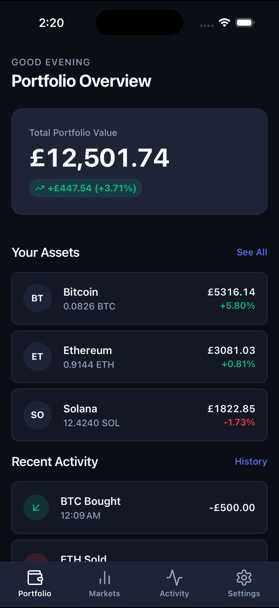
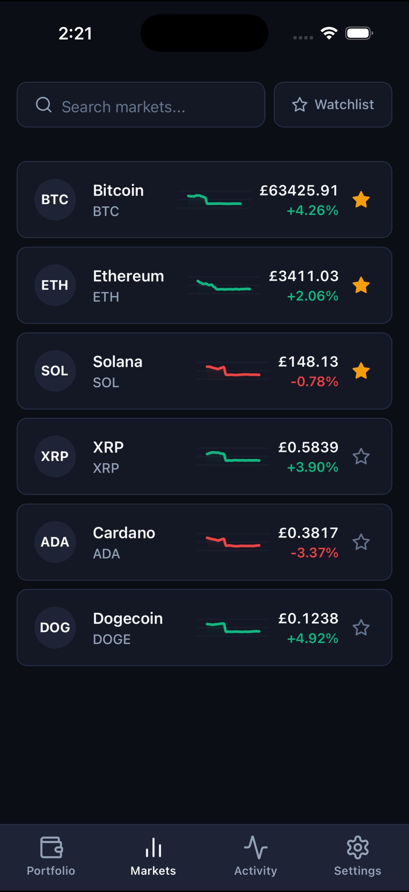
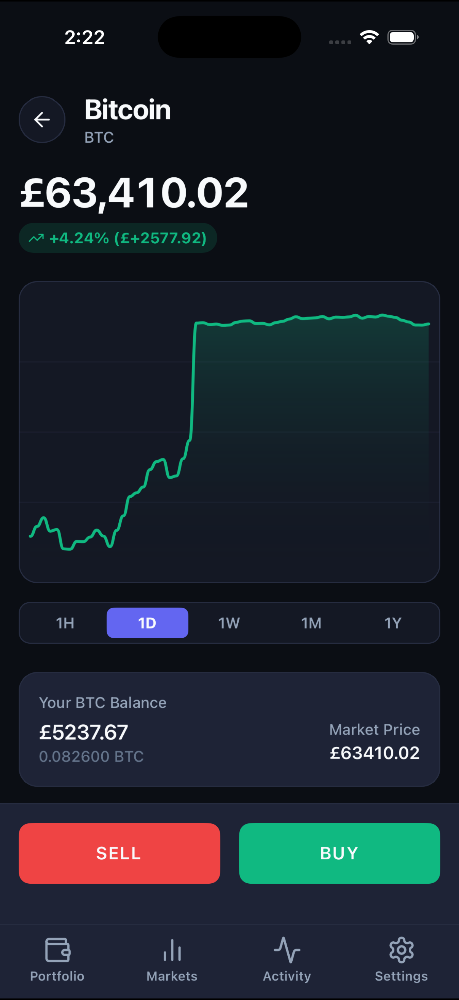
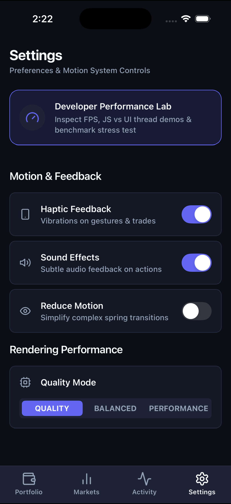

# Pulse — Motion-First Mobile Trading Simulator

**Pulse** is a mobile-first crypto trading simulation application built with React Native, Reanimated v3, React Native Gesture Handler, React Native Skia, Zustand, `@shopify/flash-list`, and Expo Router.

It serves as a showcase of mobile interaction design, gesture handling, high-frequency chart rendering, UI-thread vs JS-thread performance engineering, physical spring physics, and accessibility.

---

## Application Screenshots

| Portfolio Overview | Watchlist & Markets |
| :---: | :---: |
|  |  |

| Interactive Chart & Detail | Preferences & Performance Lab |
| :---: | :---: |
|  |  |

---

## Technical Stack

- **Framework**: React Native 0.74 / Expo SDK 51 with Expo Router v3
- **Graphics & Charts**: `@shopify/react-native-skia`
- **Animations**: `react-native-reanimated` v3
- **Gestures**: `react-native-gesture-handler`
- **State Management**: Zustand
- **List Performance**: `@shopify/flash-list`
- **Feedback Systems**: Expo Haptics & Expo AV Audio
- **Testing**: Jest & React Native Testing Library

---

## Key Features

1. **Portfolio Overview**: Animated balance counter (`AnimatedNumber`), P&L badges, asset breakdown, and pull-to-refresh.
2. **Markets Screen**: Search & watchlist filter, live Geometric Brownian Motion price ticks (500–1500ms), animated sparklines, FlashList rendering.
3. **Asset Details**: Large interactive Skia Price Chart with pan scrub crosshairs, pinch zoom, timeframe selector (1H, 1D, 1W, 1M, 1Y).
4. **Trading Bottom Sheet (`MotionBottomSheet`)**: Custom bottom sheet with spring physics, drag velocity, and snap points.
5. **Hero `SwipeToConfirm` Interaction**: Direct-manipulation drag handle, progress bar fill, 50% haptic selection feedback, 100% gesture lock, and checkmark morph animation.
6. **Developer Performance Lab**: Live FPS counter, side-by-side JS Thread vs UI Thread gesture benchmark comparison, and stress test tool.
7. **Settings**: Dark mode design system, Haptics toggle, Sound toggle, Reduce Motion support, and Quality / Balanced / Performance modes.

---

## Getting Started

```bash
# Install dependencies
yarn install

# Run unit and component test suite
yarn test

# Start Expo development server
yarn start
```

---

## Documentation

- [Architecture Guide](./docs/architecture.md)
- [Motion System & Spring Physics](./docs/motion-system.md)
- [Performance Engineering & Worklets](./docs/performance.md)
- [Gesture Architecture](./docs/gestures.md)
- [Accessibility & Reduce Motion](./docs/accessibility.md)
- [Technical Decisions & Rationale](./docs/decisions.md)

---

## Core Educational Learnings

Developers exploring or contributing to **Pulse** can gain deep practical mastery in:

- ⚡ **UI-Thread First Gesture Engineering**: How to run 60–120 FPS pan gestures, crosshair scrubbing, and physics animations entirely on the native UI thread using Reanimated v3 Worklets without dropping frames.
- 🎨 **GPU-Accelerated Graphics with Skia**: Constructing high-frequency financial charts, continuous gradients, and responsive crosshair overlays powered by `@shopify/react-native-skia` on the native GPU.
- 🏎️ **List & State Performance**: Offloading rapid market updates via Zustand atomic selectors and rendering high-throughput lists with `@shopify/flash-list`.
- 🧮 **Direct Manipulation Physical Physics**: Designing custom physics-driven UI controls (`SwipeToConfirm`, `MotionBottomSheet`) with custom mass, stiffness, and velocity-clamped spring profiles.
- 🔊 **Sensory UX & Accessibility**: Orchestrating haptic feedback (`expo-haptics`), audio effects, and respecting system accessibility toggles (`Reduce Motion`).

---

## Upcoming Features & Contribution Ideas

We welcome contributions! Here are planned enhancements and feature ideas perfect for open-source contributions:

- 📈 **Technical Indicators Overlay**: Implement Moving Averages (SMA/EMA), RSI, and Volume indicators on top of the React Native Skia chart.
- ⚡ **WebSocket Live Exchange Feed**: Add a toggle in Settings to switch between the synthetic Geometric Brownian Motion engine and live WebSocket feeds (e.g. Binance / Coinbase).
- 🔔 **Custom Price Alerts & Notifications**: Allow users to set price trigger alerts with native local push notification delivery.
- 💼 **Advanced Portfolio Analytics & Pie Allocation**: Interactive historical cumulative PnL graphs and dynamic asset allocation charts.
- 🏆 **Gamified Trading Challenges**: Daily paper trading simulation goals, achievements, and leaderboard rankings.
- 🧪 **Interactive Motion Playground**: Expanded Performance Lab tool to adjust spring stiffness, damping, and mass live with real-time gesture feedback graphs.

---

## Contributing

Contributions make the open-source community an amazing place to learn, inspire, and create. Any contributions you make are **greatly appreciated**.

1. **Fork the Repository**
2. **Create your Feature Branch** (`git checkout -b feature/AmazingFeature`)
3. **Commit your Changes** (`git commit -m 'Add some AmazingFeature'`)
4. **Run Unit Tests** (`yarn test`)
5. **Push to the Branch** (`git push origin feature/AmazingFeature`)
6. **Open a Pull Request**

